# Golden Child Meal Planner

The GCMP is an application that allows the user to search for recipes for food and cocktails, then save those recipes to a dynamically updating calendar.
This allows you to plan out your meals ahead of time, to help manage your time bettter.
It also allows you to save your favorite recipes to a dedicated Favorites page independant of the calendar.
Perfect for busy mothers and cooking enthusiests.

*(Note: uses Local Storage to save info)*
(*Note: the API that searches the recipes has a limit and how many searches can be done per minute. If it's not working, just wait a bit)*

[Click Here to Visit the Website](https://briangearty.github.io/Golden-Child-Meal-Planner/)

When you first arrive at the site, you'll be greeted with a landing page that covers the features and benefits of the GCMP
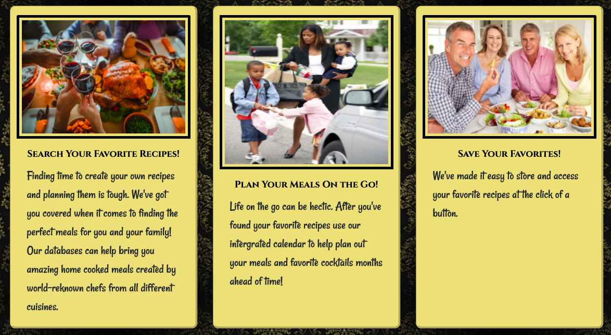

The GCMP consists of 4 web pages: The Home Page, Search, Calendar, and Favorites.
Use the *Navbar at the Top* to travel between them.

## Recipe Search Page

First, you'll want to visit the *Search* page, to look up some recipes
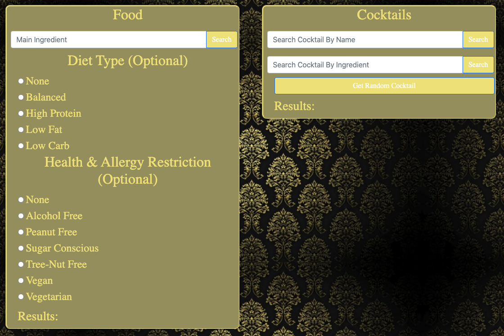

### Search Food

To look up recipes for food, use the input field on the *Left* side of the screen
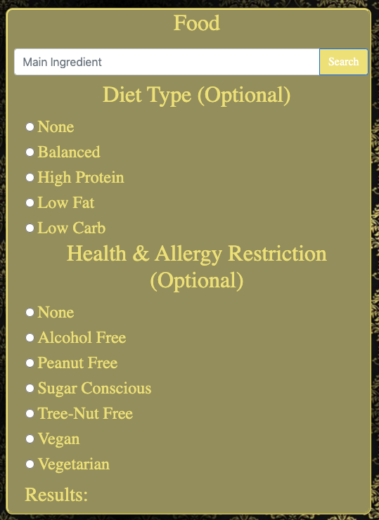

Your main search parameter goes in the text-input field at the top

You then have the *Option* to select a dietary restriction from the radio buttons
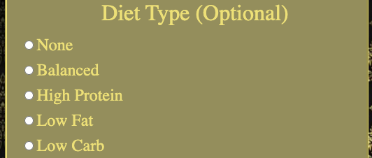

As well as refining your search by a scpecific health/allergy restriction
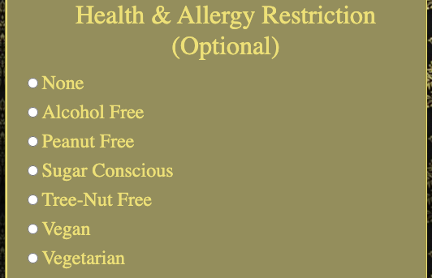

Once you've entered the information and clicked the *Search* button,
The search results will be displayed in an area beneath the input field
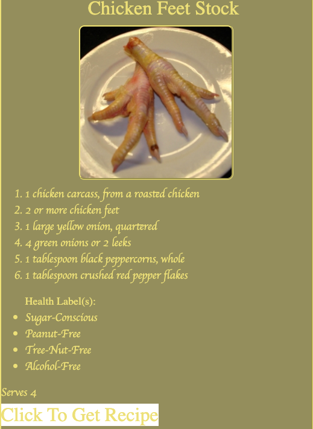

Unfortunately, while the list of ingredients can be directly displayed, the actual recipe cannot
(This is limitation of the API, not of this application)
To get the recipe, you need to click the *Click To Get Recipe* button

Which will take you to the website where the full recipe is hosted

Once you've decided on a recipe, you can schedlue it using the *Schedule Buttons* located under the *Click To Get Recipe* button
The fist button sets the *Month*, the second buttons sets the *Day*, and the third button *Adds the Recipe to the Calendar*

If you decide you want to save a recipe in case you want to make it again,
just click on the *Favorite Heart* to save it to your favorites.

Once favorited, the heart will change from Empty to Red
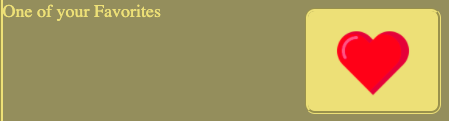

### Search Drink
#### Mostly seacrhes alcoholic drinks, but not all of them are alcoholic

For Cocktail recipes, use the input field on the *Right* side of the screen.
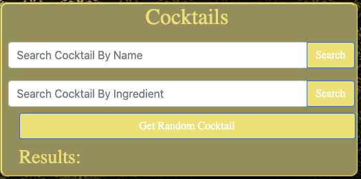

This one's design is simpler than the Food one. There's 3 ways to search;
1. Search a cocktail by *Name*
2. Search a cocktail by *An Ingredient* (Returns 5)
3. Get a cocktail *At Random*
*(Note: Each of the search methods has a dedicated search button, and ignores the text fields of the others)*

Cocktails are displayed under the Input Field, and can be *Scheduled and Favorited* in the same way as the Food Recipes
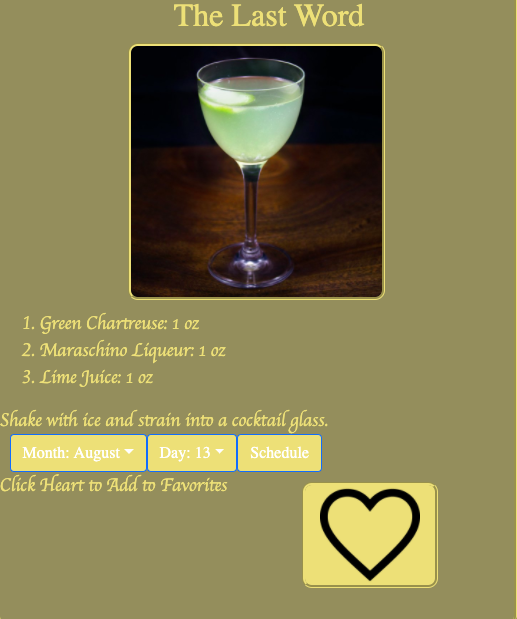

## Favorites Page

Touching on this first because it's quick and simple.

Any food and drink recipes you chose to *Favorite* are displayed here
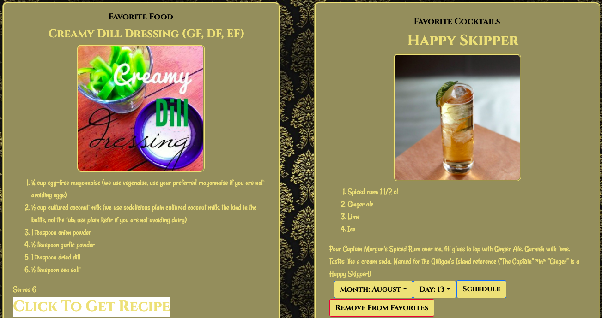

The *Schedule Buttons* work the same as on the *Search* page,
and the *Remove From Favorites* button will delete the recipe from Local Storage.
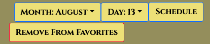

## Calendar Page

The calendar at the top of the page will display the current month.
Past dates are *Grey*, future dates are *Green*, and the current date is *Yellow*
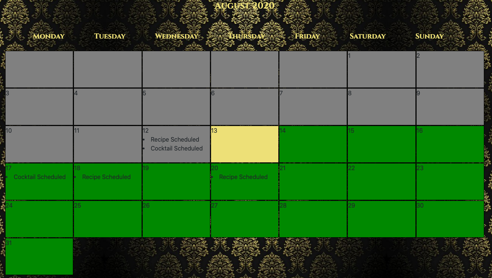

Scrolling down will reveal 2 more calendars, with the *Next Two Months*
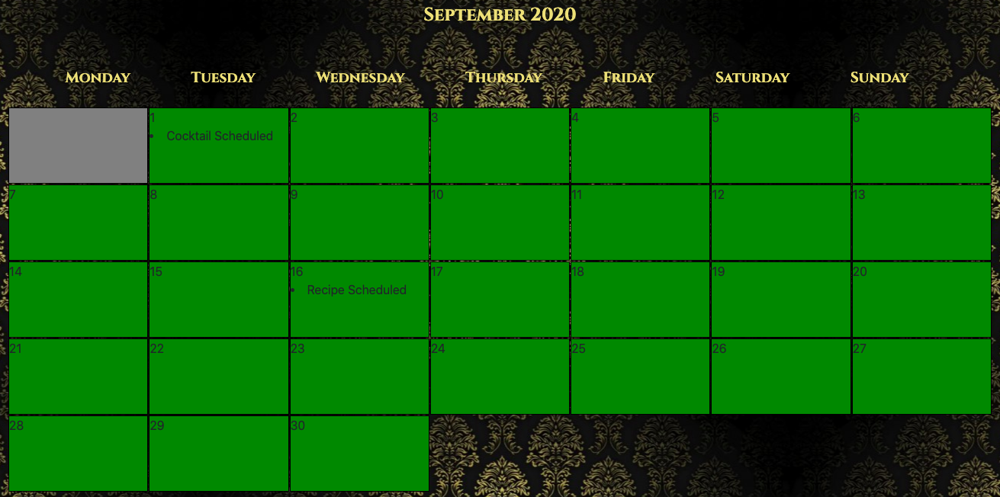

Clicking on a date where you've scheduled a Food and/or Drink recipe opens a pop-up with the info of that/those recipe(s)
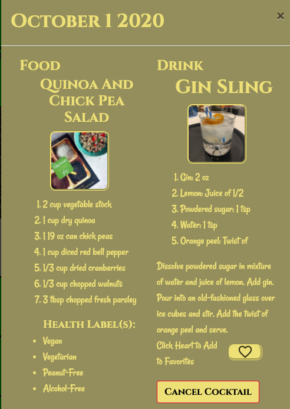

If you decide you don't want to make these recipes,
then can be individually cancelled using their respective buttons.

